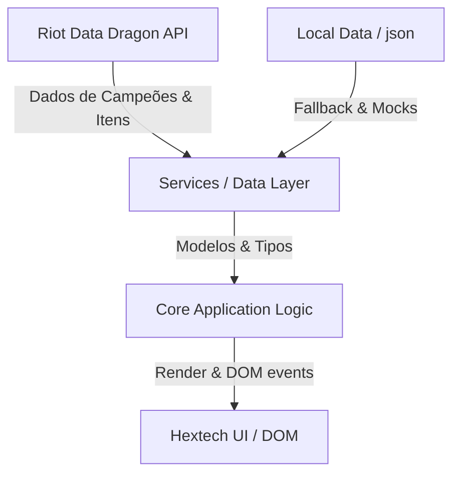

# Painel Hextech — League of Legends Dashboard

    

Painel interativo de estatísticas e build pós-partida com temática Hextech de League of Legends, alimentado diretamente pelos dados atualizados da Data Dragon API da Riot Games.

---

## 🏗️ Arquitetura do Sistema

